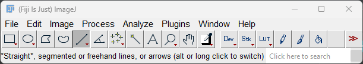

# Ferroelectric Domain Analysis
This repository contains supplemental information associated with a paper entitled **"Quantifying nano-domain size and orientation in relaxor ferroelectrics using transmission electron microscopy"** which is currently under review for the [Journal of the American Ceramics Society](https://ceramics.onlinelibrary.wiley.com/journal/15512916) (JACerS). 

The paper was written by Nathan M. Brichta. Levi Tegg, Luke W. Giles, John E. Daniels, and Julie. M. Cairney.

  
Table of Contents

  <ol>
    <li><a href="#introduction">Introduction</a>
    <li><a href="#examples">Examples</a></li>
    <li><a href="#user-guide">User guide</a></li>
    <li><a href="#license">License</a></li>
    <li><a href="#contact">Contact</a></li>
    
  </ol>

## Introduction
This README serves as an instructional guide on how to use the scripts contained in this repository for domain analysis of micrographs. The paper above details two methods for calculating domain geometry using Python. The real-space method requires some manual input on the part of the user, and so a guide on how to designate ROIs and extract pixel intensity information is required. The procedure outlined in the [real space method](#real-space-method) section will import the raw micrograph image, convert it to 8-bit format, apply a median filter, add successive ROIs across the image to produce profile plots, which are then be tabulated into a .csv that is read by the `RealSpaceMethod_SI.py` program.

## Examples
### Real-space method
The graphical output of the real-space method is a 3-panel graphic, including the sample image, examples of peaks found by the peak-finding algorithm, and a histogram detailing the distribution of domain widths in the image:

*Illustration of the real-space method:   
(a) Color-coded line selection ROIs constitute Regions 1 and 2 in the median filtered image,* $I_{filter}$*. On the bottom of the image, black arrows indicate the major domain boundaries, and red arrows indicate the approximate boundaries between nano-domains.  
(b) This plot shows the result of the peak-finding algorithm on 4 random line profiles, with the identified minima highlighted with red lines.  
(c) Histograms of the peak-to-peak (valley-to-valley) distances for both regions, according to the ROI color in (a). A Gaussian curve is fit to the resulting distributions for both regions.*

## User guide
### Real-space method
Procedure:
1. Open image in ImageJ

   

   
3. Change image to 8-bit (`Image` > `Type` > `8-bit...`)
4. Apply a median filter to the image to smooth out intensities (`Process` > `Filters` > `Median...`)

   *Note: The window size (*$r_w$*) for the median filter is dependent on the resolution of your image. Features less than* $0.5 \times r_w$ *may be misassigned values during the filtering process, which alters the outcome of the line profile.*

6. Open ROI Manager (`Analyze` > `Tools` > `ROI Manager...`):
   
   
   
7. Select the Line segment tool in the ImageJ toolbar:
   
   
	
 *Note: You can double-click the button to set the desired line width. A wider line will average out the intensities along its length, potentially improving SNR.*
 
8. Use the Line segment tool to highlight the region(s) you wish to measure. Save each selection by pressing Add in the ROI Manager, or by pressing the T key.

  
  
***Note: If you reuse the line selection to create the rest of your ROIs, the end result will be a .csv with the x-values (distance) in the first column, then y-values (pixel intensity) for each ROI in subsequent columns. If you use new line selections for each ROI, each line profile will have its own associated x and y values contained in the .csv. Personally, I recommend reusing the line selection to keep angles consistent, but in the cases of images with unusual or complex geometry, the latter might be preferred. There is a commented section in the program that also explains this.***

8. Once all ROIs have been saved, select all the ROIs (`ctrl-A` after selecting one) and save these for future reference (`More>>` > `Save...`)
  
9. Keeping all ROIs selected, open the Multi Plot window in the ROI Manager (`More>>` > `Multi Plot`):

   

10. Save the line profile data to a `.csv` file (`Data>>` > `Save Data...`). The file can then be read by the `RealSpaceMethod_SI.py` program.

<!-- LICENSE -->
## License

Distributed under the MIT License. See `LICENSE.md` for more information.

(<a href="#readme-top">back to top</a>)

## Contact
Nathan M. Brichta 

  [![ORCID][orcid-shield]][orcid-nmb]
  [![ResearchGate][researchgate-shield]][rg-nmb]
  [![LinkedIn][linkedin-shield]][linkedin-nmb]

Levi Tegg 

  [![ORCID][orcid-shield]][orcid-lt]
  [![ResearchGate][researchgate-shield]][rg-lt]
  [![Twitter/X][twitter-shield]][twitter-levi]

Luke W. Giles 

  [![ORCID][orcid-shield]][orcid-lwg]
  [![ResearchGate][researchgate-shield]][rg-lwg]
  [![LinkedIn][linkedin-shield]][linkedin-lwg]

John E. Daniels 

  [![ORCID][orcid-shield]][orcid-jed]
  [![ResearchGate][researchgate-shield]][rg-jed]
  [![LinkedIn][linkedin-shield]][linkedin-jed]
  [![UNSW][unsw-shield]][unsw-profile]

Julie M. Cairney 

  [![ORCID][orcid-shield]][orcid-jmc]
  [![ResearchGate][researchgate-shield]][rg-jmc]
  [![LinkedIn][linkedin-shield]][linkedin-jmc]
  [![USYD][usyd-shield]][usyd-profile]

(<a href="#readme-top">back to top</a>)

  <!-- MARKDOWN LINKS & IMAGES -->
<!-- https://www.markdownguide.org/basic-syntax/#reference-style-links -->
[orcid-shield]:https://img.shields.io/badge/orcid-A6CE39?style=Flat-square&logo=orcid&logoColor=white
[orcid-nmb]: https://orcid.org/0009-0008-0386-5292
[orcid-lt]: https://orcid.org/0000-0003-0496-8716
[orcid-lwg]: https://orcid.org/0000-0002-4858-1428
[orcid-jed]: https://orcid.org/0000-0002-4383-8482
[orcid-jmc]: https://orcid.org/0000-0003-4564-2675

[linkedin-shield]: https://img.shields.io/badge/LinkedIn-%230077B5.svg?style=Flat-square&logo=linkedin&logoColor=white
[linkedin-nmb]: https://www.linkedin.com/in/nathan-brichta/
[linkedin-lwg]: https://www.linkedin.com/in/luke-giles-360b74111/
[linkedin-jed]: https://www.linkedin.com/in/john-daniels-8260b0239/
[linkedin-jmc]: https://www.linkedin.com/in/julie-cairney-541a194/

[twitter-shield]: https://img.shields.io/badge/Twitter/X-%23000000.svg?style=for-the-badge&logo=X&logoColor=white
[twitter-levi]: https://twitter.com/ljtegg?lang=en

[researchgate-shield]: https://img.shields.io/badge/ResearchGate-00CCBB?style=Flat-square&logo=ResearchGate&logoColor=white
[rg-nmb]: https://www.researchgate.net/profile/Nathan-Brichta
[rg-lt]: https://www.researchgate.net/profile/Levi-Tegg
[rg-lwg]: https://www.researchgate.net/profile/Luke-Giles-2
[rg-jed]: https://www.researchgate.net/scientific-contributions/John-E-Daniels-30522271
[rg-jmc]: https://www.researchgate.net/profile/Julie-Cairney

[unsw-shield]: https://img.shields.io/badge/Staff_profile-UNSW-yellow
[unsw-profile]: https://www.unsw.edu.au/staff/john-daniels
[usyd-shield]: https://img.shields.io/badge/Staff_profile-USYD-orange
[usyd-profile]: https://www.sydney.edu.au/engineering/about/our-people/academic-staff/julie-cairney.html
